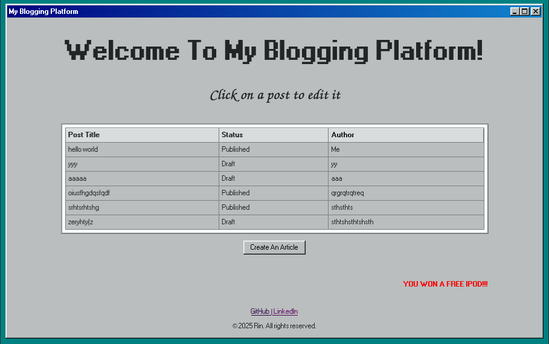

# Blogging Platform

A server side rendered blogging platform using Ruby, HTMX and PostgreSQL, designed to edit my own article entries before it's seamlessly integrated with my portfolio. This platform will serve as a place to document my coding journey and demonstrate my expertise in software development.



## Features
- Create, edit, and delete blog posts
- View blog posts and setup their status (Draft: Private, Published: Public)
- Simple markdown editor for creating content
- Fabulous Windows 98 aesthetic

## Upcoming
- Secure authentication (when it'll be done, only one user can post articles, and the rest can view the platform without making modifications.)
- A live markdown previewer (for the article editor)

## Tech Stack

- **Ruby** with **Sinatra** for the server-side API
- **Parametrized SQL Queries** with **the pg gem**
- **ERB Templates** with **HTMX** (it's included in the repository)

## Setup Instructions

- To setup Postgres automatically and locally you can use my script:
[Pwatgres](https://github.com/theflyoccultist/systems_integration_projects/tree/main/pwatgres)

- Install dependencies (gems)
```
bundle install
```

- Start the app
```
ruby app.rb
```
